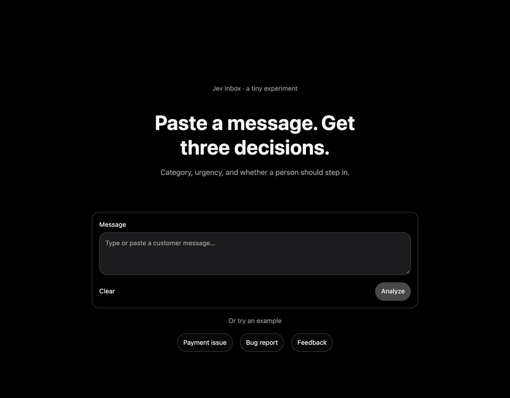
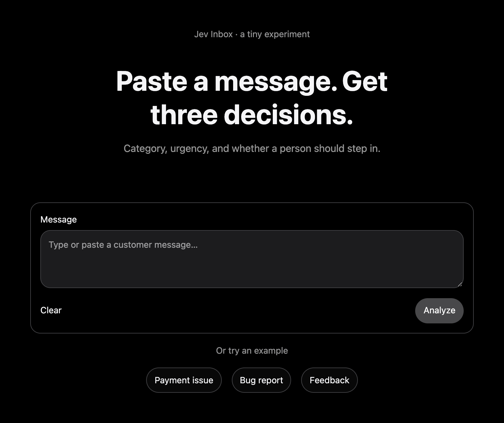
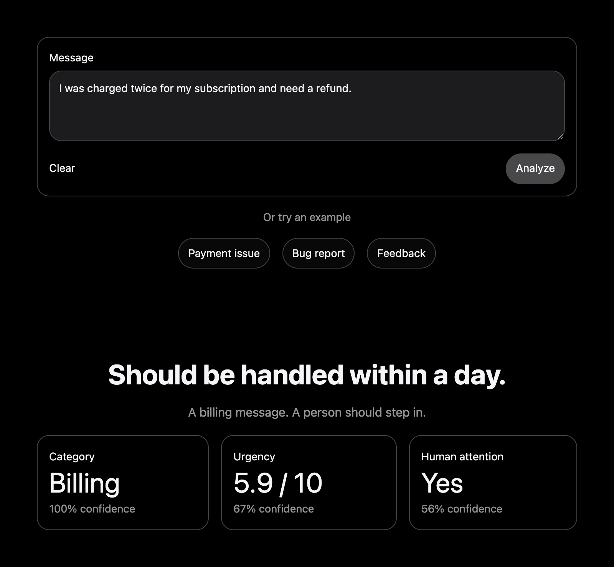
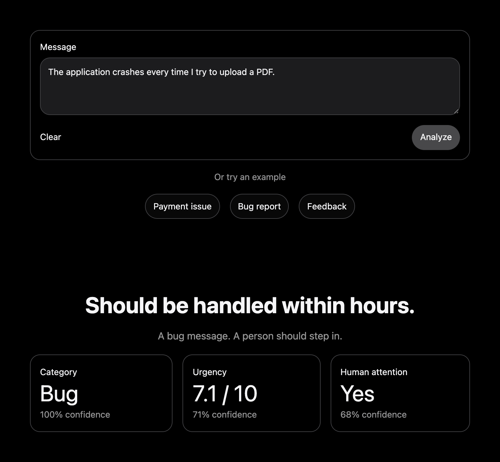
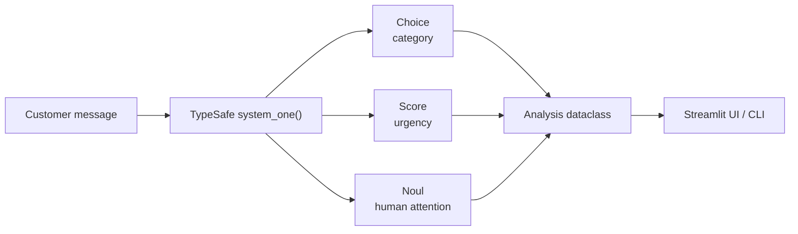

<h1 align="center">Jev Inbox</h1>

<p align="center">
  <b>Paste a message. Get three decisions.</b><br>
  Category, urgency, and whether a person should step in. Powered by <a href="https://typesafe.ai">TypeSafe AI</a>.
</p>

<p align="center">
  
  
  
  
</p>

<p align="center">
  
</p>

---

## What it does

Jev Inbox is a tiny experiment in **message triage**. You give it one customer message and it gives you three answers, each with a confidence score:

| Decision | Question asked | Possible answers |
|---|---|---|
| **Category** | What is this message about? | `Billing` · `Support` · `Bug` · `Feedback` · `General` |
| **Urgency** | How urgently does it need a response? | `0–10` score + a plain-English label, from *"Can wait"* to *"Needs immediate action"* |
| **Human attention** | Does a person need to handle it? | `Yes` / `No` |

<p align="center">
  
</p>

## Screenshots

<table>
  <tr>
    <td align="center"><br><sub>Billing: double charge, refund needed</sub></td>
    <td align="center"><br><sub>Bug: app crashes on PDF upload</sub></td>
  </tr>
</table>

## How it works

All three questions go to TypeSafe AI in **a single `system_one` call**. Each one uses a different typed question:



- **Category:** a `Choice` among five described categories. The model picks one.
- **Urgency:** a `Score` over five ordered levels. TypeSafe returns an *expected level* (0–4), which Jev scales to **0–10**. It also rounds to the nearest level for the headline label.
- **Human attention:** a `Noul` (a probabilistic yes/no). Anything **≥ 0.5** counts as *Yes*. The confidence shown is the probability of the chosen side.

The logic is in [`jev.py`](jev.py) and the interface in [`app.py`](app.py).

## Getting started

### Prerequisites

- Python **3.12+**
- [uv](https://docs.astral.sh/uv/)
- A **TypeSafe AI API key** from the [TypeSafe console](https://console.typesafe.ai/)

### Install

```bash
git clone https://github.com/<your-username>/jev-inbox.git
cd jev-inbox
uv sync
cp .env.example .env
```

Then open `.env` and add your key:

```env
TYPESAFE_API_KEY=your-api-key-here
```

### Run the web app

```bash
uv run streamlit run app.py
```

Open <http://localhost:8501>. Paste a message or click one of the example buttons, then press **Analyze**.

### Run from the terminal

`jev.py` also runs as a script. It analyzes the three built-in examples:

```bash
uv run python jev.py
```

```text
I was charged twice for my subscription and need a refund.
  Category:        Billing (100%)
  Urgency:         5.8 / 10, Should be handled within a day (69%)
  Human attention: Yes (54%)

The application crashes every time I try to upload a PDF.
  Category:        Bug (100%)
  Urgency:         7.0 / 10, Should be handled within hours (69%)
  Human attention: Yes (65%)

The new dashboard looks great. I really like the simpler design.
  Category:        Feedback (100%)
  Urgency:         0.2 / 10, Can wait, no action needed soon (94%)
  Human attention: No (80%)
```

> Results come from a live model, so the numbers may differ slightly between runs.

### Use it in your own code

```python
from jev import analyze

result = analyze("My invoice shows the wrong company name.")
print(result.category, result.urgency, result.human_attention)
```

`analyze()` returns an `Analysis` dataclass with `category`, `urgency`, `urgency_label`, `human_attention` and a `*_confidence` value for each.

## Customizing

All the triage rules are plain Python constants at the top of [`jev.py`](jev.py):

| Constant | What to change |
|---|---|
| `CATEGORIES` | Add, rename or reword categories. The descriptions guide the model. |
| `URGENCY_LEVELS` | Change the urgency scale. Keep it ordered from least to most urgent. The 0–10 scaling adapts to its length. |
| `EXAMPLES` | The example buttons in the UI and the messages used in CLI mode. |

The dark, Apple-style look is set in [`.streamlit/config.toml`](.streamlit/config.toml).

## Project structure

```text
jev-inbox/
├── app.py                 # Streamlit interface
├── jev.py                 # Triage logic (TypeSafe call + Analysis dataclass), also a CLI
├── .streamlit/
│   └── config.toml        # Dark theme
├── docs/                  # README screenshots and demo GIF
├── .env.example           # Template for TYPESAFE_API_KEY
├── pyproject.toml
└── uv.lock
```
